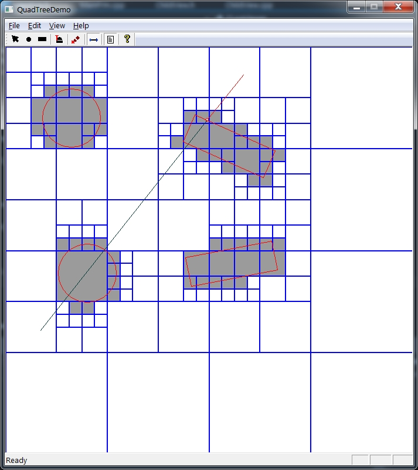

# QuadTree
QuadTree - a well-known way of dividing space. Required for working with a large number of objects in the space. For example: the choice of objects, intersections with them, pathfinding in this space.
This is an example of solving this problem.

